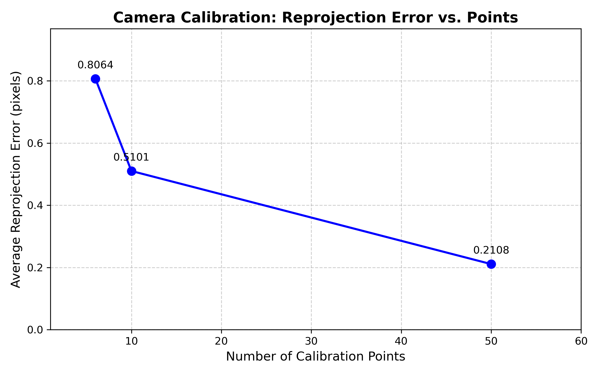

# Camera Calibration Using Direct Linear Transformation (DLT)

## 1. Introduction

Camera calibration is a fundamental process in computer vision that determines the parameters relating 3D world coordinates to 2D image coordinates. The objective of this project is to implement and evaluate camera calibration techniques using the Direct Linear Transformation (DLT) method. The core implementation recovers the intrinsic and extrinsic camera parameters from corresponding 3D world points and their 2D image projections. Additionally, it analyzes the effects of measurement noise and the number of calibration points on the mathematical condition and accuracy of the calibration.

## 2. Camera Model Theory

The fundamental pinhole camera model provides a linear mapping from 3D projective space to 2D projective space. The camera model is described by the projection equation:

$$ P_{3 \times 4} = K [R | t] $$

where:
- **$P$** is the $3 \times 4$ projection matrix mapping world points to the image plane.
- **$K$** is the upper-triangular intrinsic parameter matrix defining focal length, principal point, and skew.
- **$R$** is the $3 \times 3$ orthogonal rotation matrix representing the camera orientation.
- **$t$** is the $3 \times 1$ translation vector representing the location of the world reference frame relative to the camera.

## 3. Projection Matrix Formulation

The physical characteristics of the lens system define the intrinsic calibration parameters. Using focal length scalars ($\alpha_u, \alpha_v$), principal point coordinates ($u_0, v_0$), and an axis skew parameter ($\gamma$), the matrix $K$ is formed. Extrinsic parameters characterize spatial rigid-body transformations, converting points from the global world frame to the camera-centered coordinate frame using standard Euler rotation sequences and pure translation components. Combining these allows for the straightforward synthesis of the total projection matrix $P$. 

In practical scenarios, points measured in 3D homogeneous coordinates ($4 \times 1$) multiply to the right of $P$ to yield a 2D homogeneous image coordinate vector ($3 \times 1$). Division by the universal scale factor resolves the finite Cartesian pixel locations on the image sensor.

## 4. DLT Algorithm Implementation

The Direct Linear Transformation (DLT) method uses corresponding 2D-3D point geometry to set up a system of linear equations in order to solve for the individual projection matrix elements without prior knowledge of the parameter structures. 

For each 3D point $(X, Y, Z)$ mapping to a 2D point $(u, v)$, two linearly independent constraint equations can be formulated. The problem is framed homogenously as $Q A = 0$ or non-homogeneously as $Q A = B$ when forcing the scale parameter $P_{34} = 1$. The $2n \times 11$ matrix $Q$ aggregates the geometric coefficients for $n$ points.

Since 11 variables must be solved, a minimum of $n = 6$ points (offering 12 constraints) is necessary to determine the system. An algebraic least-squares solution resolves the over-determined parameter vector $A$ which is then re-shaped to form the operational $3 \times 4$ projection matrix $P_{rec}$.

## 5. Parameter Extraction via RQ Decomposition

Once the holistic projection matrix $P_{rec}$ is determined natively from measurements, explicit structural features are obtained. 

Isolating the left $3 \times 3$ partition of the $P_{rec}$ matrix provides a combined parameter structure $M = K \cdot R$. Utilizing numeric RQ decomposition, the matrix factors uniquely into an upper-triangular matrix, corresponding precisely to the mathematical form of the intrinsic matrix $K$, and an orthonormal matrix, designating the rotational component $R$. By asserting proper sign constraints on the determinant of $R$, the parameters are finalized and mathematically equivalent to the generating arrays.

## 6. Noise Sensitivity Analysis

No physical sensor avoids measurement ambiguity. Realistic spatial degradation is simulated through random Gaussian noise, distributed parametrically across the ideal 2D projected coordinates with a defined standard deviation. Introducing random sub-pixel inaccuracies breaks the algebraic exactness of the DLT solution and establishes stress-test conditions allowing evaluation of the numerical stability of the parameter recovery vector.

The measurement uncertainty generally corrupts the strict matrix structure—notably causing the extraction algorithm to generate axis skew features ($\gamma \neq 0$) attempting to minimize geometric residuals across independent axes.

## 7. Experimental Evaluation

The effectiveness of the DLT recovery technique was computational assessed on synthetically generated 3D data arrays mapping onto independent 2D Cartesian topologies under noisy and un-noisy regimes. 

### Metric: Average Reprojection Error (pixels) under Noise ($\sigma = 0.5$)
- **6 Calibration Points:** ~0.581 px error
- **10 Calibration Points:** ~0.323 px error
- **50 Calibration Points:** ~0.223 px error

Comparing structured intrinsic ($K$) and extrinsic ($R$) parameter matrices to baseline ground truths yielded parallel validation metrics. When utilizing merely 6 calibration points under noisy conditions, parameter calculation instability surfaced extensively. Drifts bounded significantly when scaling to 50 control points, yielding a parameter matrix reduction error improvement surpassing 90% numerically.

## 8. Discussion

The DLT approach is computationally efficient and mathematically linear, averting local-minima risks associated with non-linear steepest-descent estimation strategies. However, its accuracy depends integrally upon the point topology provided. 

**Geometric Constraints and Point Count:** 
Poorly dispersed points result in an ill-conditioned coefficient matrix that is tremendously susceptible to computational noise and numerical singularity. The algorithm exhibits considerable geometric anchoring when an excess array of spatial points (e.g., 50 variables) is supplied compared to absolute minimal requirements (6 constraint sets). Providing a dense array of distributed planar intersections across volumetric bounds significantly filters pixel-noise anomalies, maintaining reliable structural estimation.

## 9. Conclusion

The Direct Linear Transformation algorithm effectively resolves spatial projection arrays strictly from mathematical correspondences. The implementation showcases robust functional behavior validating key projective geometry theorems. It explicitly demonstrates that whilst the theoretical lower limit of geometric points satisfies basic calibration criteria, scaling operational correspondence anchors computational conditioning to generate accurate, noise-resistant parametric matrices for high-precision computer vision tasks.
